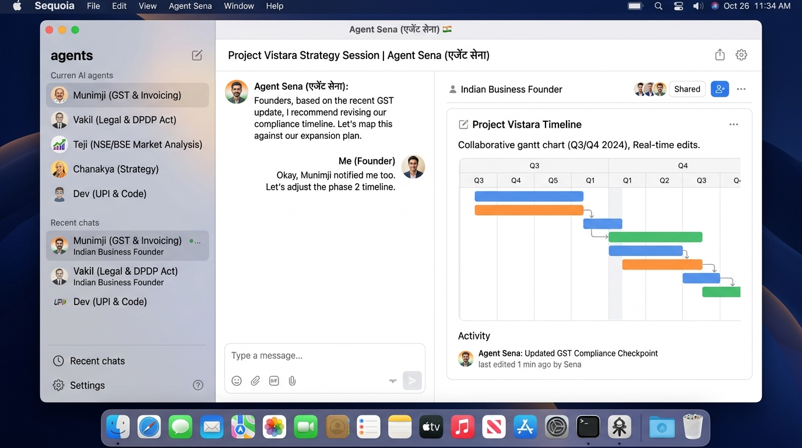

# Agent Sena (एजेंट सेना)

[](https://github.com/KashinathTilagul/agent-sena/stargazers)
[](./LICENSE)



Agent Sena (एजेंट सेना) is India's sovereign platform for running persistent, autonomous AI teammates with an authentic Apple MacBook macOS aesthetic. It is available on the web, as an Electron desktop app, and through an Expo mobile app. Bring your own model and sandbox provider, or run the complete stack locally.

Agent Sena is in active release. Explore more at [https://github.com/KashinathTilagul/agent-sena](https://github.com/KashinathTilagul/agent-sena).

## The Sena Squad (भारतीय सेना)

- 🇮🇳 **Munimji (मुनीमजी)**: Automated GST filing, Indian e-invoicing, TDS deduction, and ledger bookkeeping
- 🇮🇳 **Vakil (वकील)**: Indian legal compliance, Companies Act 2013, contract drafting, and DPDP Act 2023 compliance
- 🇮🇳 **Teji (तेजी)**: Real-time analysis of NSE/BSE, Nifty 50, BankNifty, and SEBI regulatory circulars
- 🇮🇳 **Chanakya (चाणक्य)**: Business growth strategy, Indian market go-to-market execution, and competitive intelligence
- 🇮🇳 **Dev (देव)**: Fullstack engineer with native UPI QR, Razorpay, Cashfree, and Aadhaar/DigiLocker API connectors

## Features

- Persistent bots with their own conversations, memory, routines, and history
- Voice mode: speak replies, dictate, and call a bot. Bring your own ElevenLabs, OpenAI, or Cartesia key
- Shared Team Computers and isolated Private computers
- Browser, terminal, file, and graphical desktop access
- Bots that can delegate to peer bots or short-lived subagents
- Bring-your-own model credentials through Pi (Claude 3.7, GPT-4o, DeepSeek, Ollama)
- App integrations through Composio or Pipedream Connect, plus user-installed Treg, remote MCP, and OpenAPI tool sources
- Docker, E2B, Daytona, Box, and native lightweight non-Docker operation

## Demo


Video demonstration: [./docs/screenshots/demo.mp4](./docs/screenshots/demo.mp4)

## Stack

- TypeScript
- React 19, Vite, and Tailwind CSS (macOS Sonoma / Sequoia aesthetic)
- Electron and Expo
- Hono and oRPC
- PostgreSQL and Prisma
- Better Auth
- Graphile Worker
- Pi
- Docker, E2B, Daytona, and Box
- Composio, Pipedream Connect, MCP, and OpenAPI integrations

## Quick start

```bash
git clone https://github.com/KashinathTilagul/agent-sena.git
cd agent-sena
cp .env.example .env
pnpm install
pnpm db:generate
pnpm db:migrate
pnpm dev
```

Open [http://127.0.0.1:5173](http://127.0.0.1:5173), create an account, connect a model, and deploy your first agent.

## Desktop and mobile

The Electron and Expo apps are clients of the same Agent Sena API used by the web app.

With the development stack running, launch Electron with:

```bash
pnpm --filter @rakazo/desktop dev
```

## Documentation

- [Self-hosting guide](./docs/self-host.md)
- [Computer runtime and isolation](./docs/computer-runtime.md)
- [Mobile releases](./docs/mobile-release.md)
- [Performance testing](./docs/performance.md)

## Contributing

Contributions are welcome. Please read [CONTRIBUTING.md](./CONTRIBUTING.md) before opening a pull request.

Agent Sena is licensed under the [Apache License 2.0](./LICENSE).
